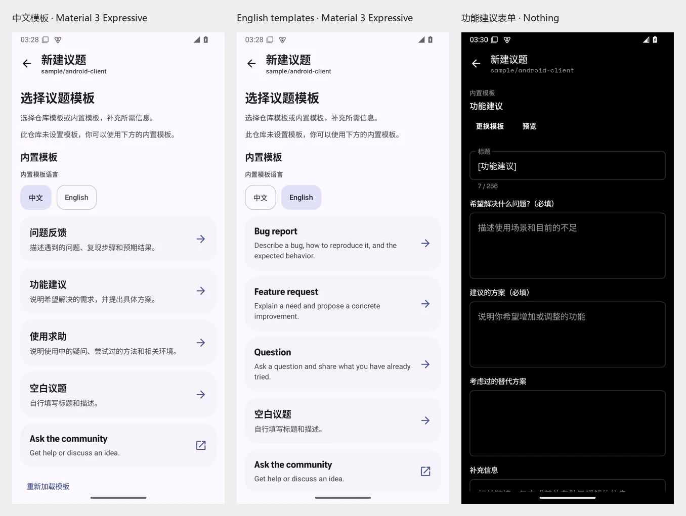

# Issue templates

Open a repository's Issues page and choose **New issue**. After signing in, choose a repository or built-in template, complete the required fields, review **Preview**, and choose **Create issue**. Successful creation opens the new issue through the existing native navigation.

## Supported behavior

- Three built-in forms are bundled with the app: **问题反馈 / Bug report**, **功能建议 / Feature request**, and **使用求助 / Question**. The chooser has explicit **中文 / English** controls and defaults to Chinese for a Chinese app locale, otherwise English. All questions, hints, title prefixes, and published headings follow the chosen template language. These forms work even when the repository has no templates and assume no repository labels or assignees.
- The built-in language choice is retained with the current draft. Changing the chooser language does not translate or overwrite an existing draft; selecting a replacement template uses the same edit confirmation as repository templates. Repositories that disable blank issues continue to require their own templates.
- Markdown templates prefill the title and body and carry their label and assignee defaults into the creation request.
- YAML Issue Forms render Markdown instructions, text inputs, text areas, single or multiple dropdowns, and checkboxes. Required text, dropdown choices, and individually required checkboxes are validated before submission. Code output respects the form's `render` setting and uses a fence that cannot be closed by backticks in the answer.
- Preview shows the Markdown body that will be sent to GitHub. Instruction-only Markdown fields are not inserted into the published issue.
- `blank_issues_enabled` controls the blank issue option. `contact_links` appear as external destinations. Failure to read the template configuration blocks native publication until the load succeeds.
- Template selection and answers are saved with the composer's `SavedStateHandle`. Configuration changes and Android screen-state restoration retain the draft. Cancelling a template replacement preserves all edits. Closing the composer removes its navigation-scoped draft.
- Submission dismisses the keyboard, locks editing, and prevents duplicate requests. A failure retains the draft for an explicit retry without reopening the keyboard over its error message; success clears saved draft state.

## Discovery and fallback

The loader reads `.github/ISSUE_TEMPLATE` on the default branch through the existing authenticated Contents API. It understands `.md`, `.markdown`, `.yml`, and `.yaml` files, with `config.yml` taking precedence over `config.yaml`. Configuration files never appear as issue templates.

If no local template directory is populated, legacy `.github/ISSUE_TEMPLATE.md`, `ISSUE_TEMPLATE.md`, and `docs/ISSUE_TEMPLATE.md` are checked. A repository without its own templates can inherit the owner's public `.github` repository templates. A local template configuration, even without templates, overrides those defaults.

Unsupported form controls, unsupported project/type metadata, malformed files, and files exceeding the native limits remain visible with an **Open on GitHub** route. Authentication, rate-limit, and server errors are distinguished from a missing template directory. Repository-provided download URLs are not used to fetch templates.

GitHub may ignore label and assignee defaults when the signed-in account lacks the required repository permissions. The editor displays those defaults and explains their permission dependency.

## Implementation

- `GithubIssueTemplateParser` composes SnakeYAML nodes without constructing repository-specified Java objects. It bounds document size, nesting, collection aliases, field count, and option count, and rejects duplicate keys and field IDs. Reading scalar nodes preserves values such as `Yes`, `No`, and version numbers.
- `GithubIssueTemplate` validates form answers and produces the Markdown body consumed by the existing REST creation endpoint. Template metadata is sent only during creation, so editing an issue's title/body cannot replace its labels or assignees.
- The form uses the shared 640 dp content limit, responsive text, 48 dp selection targets, and keyboard insets. It follows Nothing, Material 3 Expressive, and Miuix theme tokens.
- `IssueTemplateSample` is a debug-only fixture using the production parser, ViewModel, and composables. Both its template source and publisher are local implementations; the fixture cannot post an issue to GitHub.

Verification results are recorded in [issue-templates/VERIFICATION.md](issue-templates/VERIFICATION.md) and [native-validation.json](issue-templates/native-validation.json).

