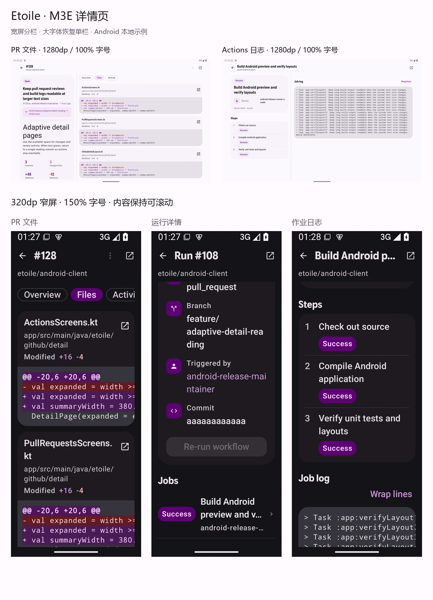
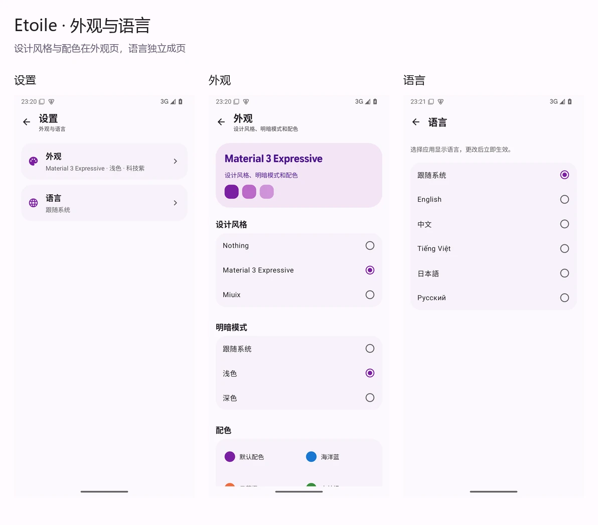

# Etoile · M3E 页面验证

验证日期：2026-09-17。Nothing 仍是默认主视觉；M3E 与 Miuix 是独立可选风格。
本轮原生改动集中在主页面、共享布局、外观与语言设置，以及 PR、Actions、阅读和表单的适配。
画布中的 56 个画面是页面与导航设计规格，不代表 56 个页面均已单独重写。

## 最新交付：大屏适配与 Issue 模板

大屏适配的完整检查与安装包校验见 [接管验收记录](../large-screen/VERIFICATION.md)。

当前可安装的调试版本为 **11**，包含本页的 M3E 布局改动，以及仓库模板、三套中英文内置模板、必填校验、预览和失败重试。

- [arm64-v8a APK（11）](../../../app/build/outputs/apk/debug/Etoile-Android-arm64-v8a-0.1.0-26091701-11.APK)
- [armeabi-v7a APK（11）](../../../app/build/outputs/apk/debug/Etoile-Android-armeabi-v7a-0.1.0-26091701-11.APK)
- [模板预览](../issue-templates/bilingual-templates.webp) · [模板验证记录](../issue-templates/VERIFICATION.md)

模板阶段累计 424 项单元测试和 17 项原生检查通过，Lint 为 0 错误、104 条警告。
下文的 387 项测试及 04 安装包属于先前布局阶段的历史记录；各模板检查对应的构建版本见模板验证记录。

## PR 与 Actions 详情页

- PR 文件和活动页、Actions 运行和作业页使用最多 1200dp 的内容宽度。
- 分栏阈值随系统字号增长；侧栏也随字号增宽。空间不足时恢复单栏，PR 概览保留 840dp 阅读上限。
- M3E 和 Miuix 的元信息行给标签和值分配独立空间；窄屏改为上下排布，长用户名不会挤出竖排标签。
- PR 差异卡片先显示完整文件名，再显示可选择的目录路径；状态与增删数量可以换行。
- PR 活动页输入内容在宽度、字号变化后保留；运行页可以进入作业详情并返回。



布局检查覆盖三种风格、320dp/840dp/1280dp 宽度和 100%/150% 字号。
23 项布局检查与 2 项交互检查通过，具体组合见 [详情页验证记录](detail-validation.json)。
这些检查使用生产 Compose 页面和本地示例状态；仓库与发布页另做了窄屏元信息截图复查。

## 外观与语言

- 设置首页提供「外观」和「语言」两个入口，并显示当前选择。
- 外观页集中展示设计风格、明暗模式和配色；Nothing 延续固定单色。
- 语言页单独展示系统、English、中文、Tiếng Việt、日本語、Русский。
- 语言保存后立即刷新界面，并恢复当前页面与返回栈。
- 从 Nothing、M3E、Miuix 相互切换时保留外观页和页面状态。



已通过正式 `EtoileActivity` 入口检查：语言切换后仍停留在语言页；返回进入设置首页；
语言、设计风格及海洋蓝配色在进程重启后仍然保留；三种风格切换不会退回首页。
检查结束后，模拟器应用恢复为 Nothing、跟随系统明暗和跟随系统语言。

## 构建与自动检查

| 检查 | 结果 |
| --- | --- |
| `:app:assembleDebug` | 通过，生成 arm64-v8a 与 armeabi-v7a 调试 APK |
| `:app:testDebugUnitTest` | 387 项通过，0 失败、0 错误、0 跳过 |
| `:app:lintDebug` | 0 错误、104 条警告 |
| `:app:compileReleaseKotlin` | 通过 |
| `:app:processReleaseMainManifest` | 通过；不包含调试预览 Activity |
| Release Kotlin 类 | 不包含 `takagi.ru.monica.debug` 包，包括三组预览入口与样例 |
| `git diff --check` | 通过 |

构建仍包含依赖版本、弃用 API、未使用资源等警告，以及 Kotlin/R8 元数据兼容性提示。
这里验证了 Release Kotlin 编译和清单，不表示已生成或测试签名发布 APK。

本轮调试包：

- [arm64-v8a APK](../../../app/build/outputs/apk/debug/Etoile-Android-arm64-v8a-0.1.0-26091701-04.APK)
- [armeabi-v7a APK](../../../app/build/outputs/apk/debug/Etoile-Android-armeabi-v7a-0.1.0-26091701-04.APK)

最后一次完整构建日志在 `.codex-tmp/m3e-resume-build.log`。
结构化检查结果见 [原生验证记录](native-validation.json)。

续作中修正了一项既有认证测试的异常身份断言：协程恢复堆栈可能复制异常，测试现在检查错误类型、
内容、原始原因和响应体关闭，不再要求跨挂起点保留同一个异常实例。

## Android 模拟器布局检查

使用 Android API 35 模拟器，密度 420dpi；尺寸为显示窗口覆盖值，不代表实体设备测试。
布局样例调用生产 Compose 组件，使用固定本地数据。

| 窗口与设置 | 检查范围 |
| --- | --- |
| 1080 × 2400px，约 411 × 914dp，100% 字体 | 中文浅色和深色：首页、通知、探索、商店、个人页、仓库、设置、外观、语言 |
| 840 × 2100px，320 × 800dp，150% 字体 | 英文深色主要页面和三个设置页面，检查文字换行、滚动及控件可达性 |
| 3360 × 2100px，1280 × 800dp，100% 字体 | 首页四列入口，个人页和仓库双栏，顶部栏与内容居中 |
| 800 × 360dp，150% 字体 | 短横屏导航栏可滚动至最后一个目的地并进入个人页 |
| 键盘显示 | 创建 Issue 的操作可滚动至键盘上方；来源编辑输入和添加操作可达 |
| Nothing 与 Miuix | 首页、个人页的基础回归；设置、外观、语言的进入、选择与返回 |
| 840dp / 1280dp，100% 与 150% 字号 | PR 文件、Actions 运行和作业在双栏与单栏之间切换 |
| 320dp，150% 字号 | 长文件名、长分支、触发者与作业日志；另查 Nothing/Miuix 元信息以及仓库、发布页 |

交互检查还包括：商店目录查询在打开来源管理后保留；来源列表不受目录查询过滤；
关闭再打开来源管理后保留输入；F-Droid 错误状态仍可切换目录。
调试页面验证了三种风格下五种指定语言的即时更新与返回；正式入口另行验证了语言和外观的持久化。

预览：

- [浅色主页面](previews/main-light.webp) · [深色主页面](previews/main-dark.webp)
- [宽屏首页](previews/wide-home.webp) · [宽屏个人页](previews/wide-profile.webp) · [宽屏仓库](previews/wide-repository.webp)
- [三种视觉风格](previews/three-styles.webp) · [窄屏探索](previews/narrow-explore.webp) · [大字体语言页](previews/narrow-language.webp)
- [大字体配色列表](previews/narrow-palette.webp)：320dp / 150% 字体下可滚动到最后一个配色。
- [键盘下的创建表单](previews/keyboard-create-issue.webp) · [来源编辑](previews/source-editor.webp) · [阅读与账户](previews/secondary-pages.webp)
- [详情页对照](previews/adaptive-details.webp) · [宽屏 PR](previews/wide-pull-request.webp) · [宽屏运行](previews/wide-actions-run.webp) · [宽屏日志](previews/wide-actions-job.webp)

## 可编辑 M3E Canvas

[打开画布入口](index.html)，或在 [M3E Canvas](https://lnkiai.github.io/m3e-canvas/) 中导入 JSON。
五组文档均已在实际托管编辑器中打开，预览跳转通过且无页面脚本错误。

| 文档 | 画面 | 已验证预览跳转 |
| --- | ---: | ---: |
| 主页面 `workspace.json` | 17 | 17 |
| 仓库与代码 `repositories.json` | 10 | 3 |
| Issue 与 PR `conversations.json` | 9 | 4 |
| 账户与设置 `accounts.json` | 10 | 2 |
| 自动化与应用 `operations.json` | 10 | 6 |
| 合计 | 56 | 32 |

主页面的检查覆盖首页工作入口、个人页账户入口，以及设置首页与独立外观、语言页的往返。
两个项目中的设置画面由同一段生成逻辑维护。每个 JSON 都小于 100KB。
详细结果见 [画布验证记录](canvas-validation.json)，其中宽屏的 PR 活动跳转、运行与作业往返另外记录在
[宽屏画布验证](canvas-wide-validation.json)。作业日志换行按钮也完成了状态切换检查。

重新生成文档和分享链接：

```powershell
node docs/design/m3e-canvas/generate.mjs
```

## 验证范围

画布预览和调试样例验证布局及本地回调，不代替服务端验证。
本轮没有实际执行 OAuth 授权、已登录账户的远端写入、应用下载或系统安装流程。
没有声称所有 56 个设计画面都完成了逐页端到端测试。
原有仓库、ViewModel 和领域逻辑由上述单元测试覆盖。

原始截图、UI 节点和交互脚本保存在本地 `.codex-tmp/m3e-screens/` 与 `.codex-tmp/`；
可随项目保留和分享的压缩预览在本目录的 `previews/`。
